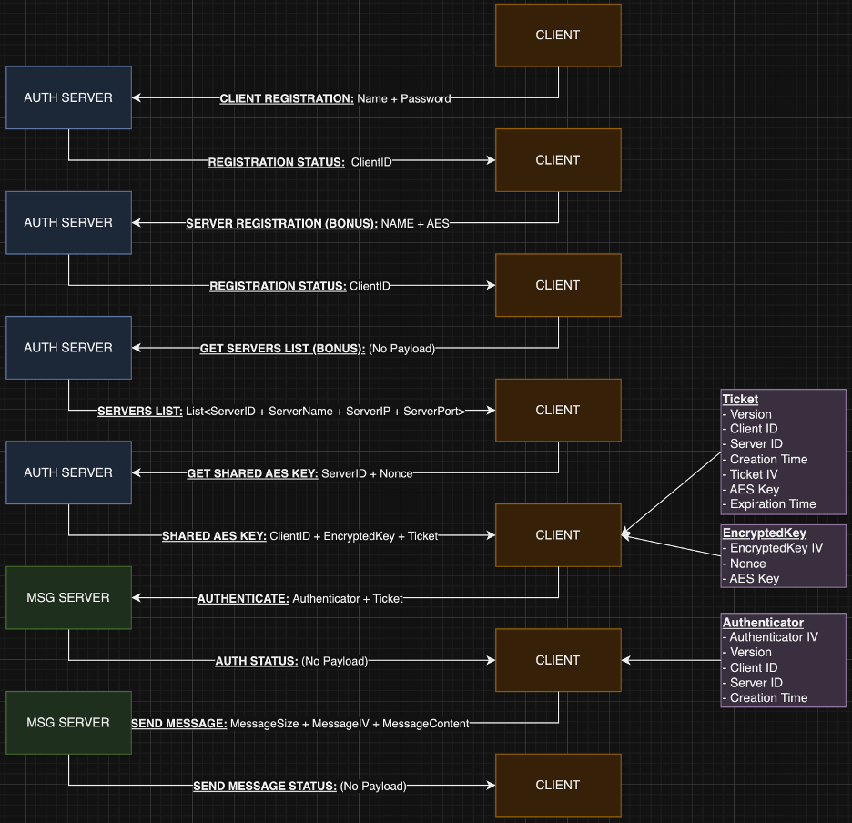

# Full Protocol Flow


# A Brief Overview
The project acts as an example for Kerberos Authentication Protocol. Sadly, 
due to the fact that I'm working a full-time job as a Senior Software 
Engineer in an Israeli Tech Unicorn, as well as serving "milluim" in Unit 
8200 and studying for my B.Sc in Computer Science at the Open University, I 
didn't have the time to properly test the project. However, I believe that 
overall the code structure makes sense and that the protocol is implemented 
fairly decent. If there's any room for consideration, I'd highly appreciate it.

# Architecture
1. The code is split into 3 "sub-programs" - `Authentication Server`, `Client` 
   and `Messages Server`. The `Authentication Server` is responsible for
   authenticating the `Client` and providing it with a `Ticket` and a 
   `Session Key`. The `Messages Server` is responsible for receiving 
   an `Authenticator` from the client as well as the `Ticket`, authenticate 
   the session and then process the message.
2. Both servers share access to the same `DB` file, which is a simple 
   `sqlite3` database, hence the usage of a `server_common` folder.
3. The `attacks` folder contains the code used to mimic an `Offline 
   Dictionary Attack`. The actual attack is implemented in the
   `offline_dict_attack.py` file, where we try to guess the `Client`'s 
   password based on a `sniffed` Nonce + IV + Encrypted Nonce.

# Setup
1. In order to execute any of the servers or the client, you need to have 
python3 installed. In addition, you need to install the required packages:
```bash
pip install -r requirements.txt
```

2. In order to execute the `Authentication Server`, you'll need to have the 
   auth_server, common and server_common folders in the same directory. You 
   can then go ahead and execute the main.py file in the auth_server folder.
```bash
cd auth_server
python auth_server/main.py
```

3. In order to execute the `Client`, you'll need to have the client_side 
   and common folders in the same directory. You  can then go ahead and 
   execute the main.py file in the client_side folder.
```bash
cd client_side
python client_side/main.py
```

4. In order to execute the `Messages Server`, similarly to the 
   Authentication Server, you'll need to have the auth_server, common and
   server_common folders in the same directory. You can then go ahead and
   execute the main.py file in the messages_server folder.
```bash
cd messages_server
python messages_server/main.py
```

# Configuration
1. There are some pre-defined client `flows` that you can use to test the 
   protocol behavior in the `factory.py` file in the client_side folder. In 
   order to use one or more of these flows, you need to override the 
   previously selected flow in the `client_side/main.py` file.
2. If a `me.info` file exists, a Client will use the information in it to 
   authenticate with the Authentication Server. If the file does not exist, 
   the Client will create it and then authenticate with the Authentication 
   Server.
3. `auth_server/port.info` contains the port on which the Authentication 
   Server runs. If you modify it, you need to modify the
   `client_side/srv.info` file as well accordingly.

# Notes
1. I added to Code request 1025 (Server registration) 2 fields - `ip` & `port`.
   The ip is a 4 byte field whereas the port is a 2 bytes field. To 
   streamline the process I just hardcoded the ip to `0.0.0.0` on client 
   side and added a random selection of port between `1000-9999`.

## Contact
Erez Drutin - drutinerez3@gmail.com